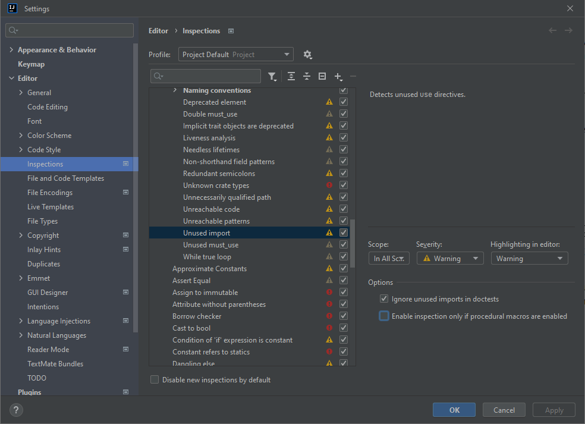

# Known issues

## IntelliJ IDEA

IntelliJ adds by default the `javafx.base` and `javafx.graphics` to the modules of Java 9+. This might be causing issues
in Java 9 and above, as the `javafx.controls` and `javafx.fxml` are missing from the modules causing
an `IllegalAccessException` when trying to run the application.

Add the following options to the `VM Options` in the run configuration of IntelliJ to fix this issue.

    -p "<PATH TO JAVAFX SDK>\lib" --add-modules javafx.controls,javafx.fxml,javafx.graphics,javafx.media,javafx.web,javafx.swing

You need to add `javafx.swing` in the modules list if you want to use ScenicView for inspecting the JavaFX UI. If you
don't do this, the application will crash when trying to attach to the Java process that is running JavaFX.

### Unused imports not cleaned for Rust

As of the latest plugin version for Rust, the imports that are unused
are not anymore auto cleaned when pressing `Ctrl+Alt+O`.

To fix this issue, go to `Settings > Editor > Inspections > Rust > Lint`.
Uncheck the `Enable inspection only if procedural macros are enabled`

## White box glitch

Add the following VM option if you're experiencing white boxes in the UI. This option is enabled by default on the
pre-built versions.

    -Dprism.dirtyopts=false